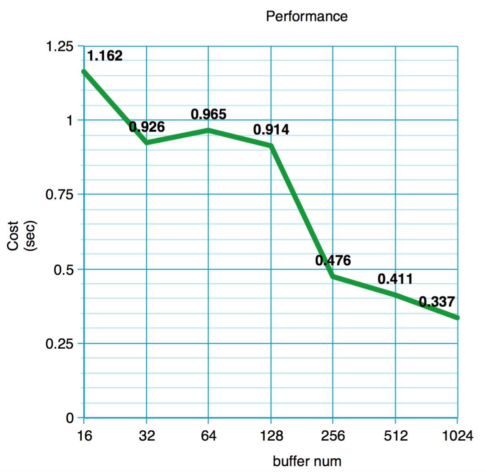

# Disk-based B+ tree with buffer

Database System Project #3

---
---

## Table of Contents

#### 1. Design
1.1. Buffer  
1.2. Buffer Cache Memory  
1.3. LRU List  

#### 2. Result
2.1. Execution Envrionment  
2.2. Test-set  
2.3. Performance  
 
 

---

## 1. Disign

#### <h3>1.1. Buffer

Compared to the previous B+ tree without any buffer management, the buffered B+ tree shows a remarkable performance improvement. Because the buffer keeps page information on disk in memory and reduces access to disk. Particularly, while the disk was accessed each time the page was updated before, now the buffer would hold the processing and then process it in an unavoidable situation, reducing the time consuming.
  

#### <h3>1.2. Buffer Cache Memory

The buffers described above are managed more efficiently by creating buffer pools in memory. The larger this buffer pool, the more buffers it can store, which saves more time, but it is memory constrained. Therefore, I declare the buffer pool as large as possible for the limited memory range, and all pages on disk are saved in this cache serializably. 
  

#### <h3>1.3. LRU List

The LRU_list with the size of the given buffer number serves as a real buffer manager. This linked list, which follows the Least Recently Used policy, is usually based on the temporal intensities of the pages that have not been accessed for the longest and are most likely not to be accessed in the near future.   Each LRU node that makes up this list
consists of information such as `page`, `page_offset`, `is_dirty`, `pin_count`.
  

---

## 2. Result

#### <h3>2.1. Execution Envrionment

|        	| Local              	| 
|--------	|--------------------	|
| OS     	| Ubuntu 16.04.3 LTS 	| 
| CPU    	| 2                  	| 
| Memory 	| 2GB                	| 

 

#### <h3>2.2 Test-set

As the number of buffers increased, 200 inserts, 200 finds, 200 delete and 200 finds were executed consecutively. 
Due to the limited performance of the local computer, **the leaf order and internal order were set to 4**, unlike the specification.

 

#### <h3>2.3. Performance

As the number of buffers increases, you can see that the time required is reduced.  
Improved performance!
 

> 

 
 

---

